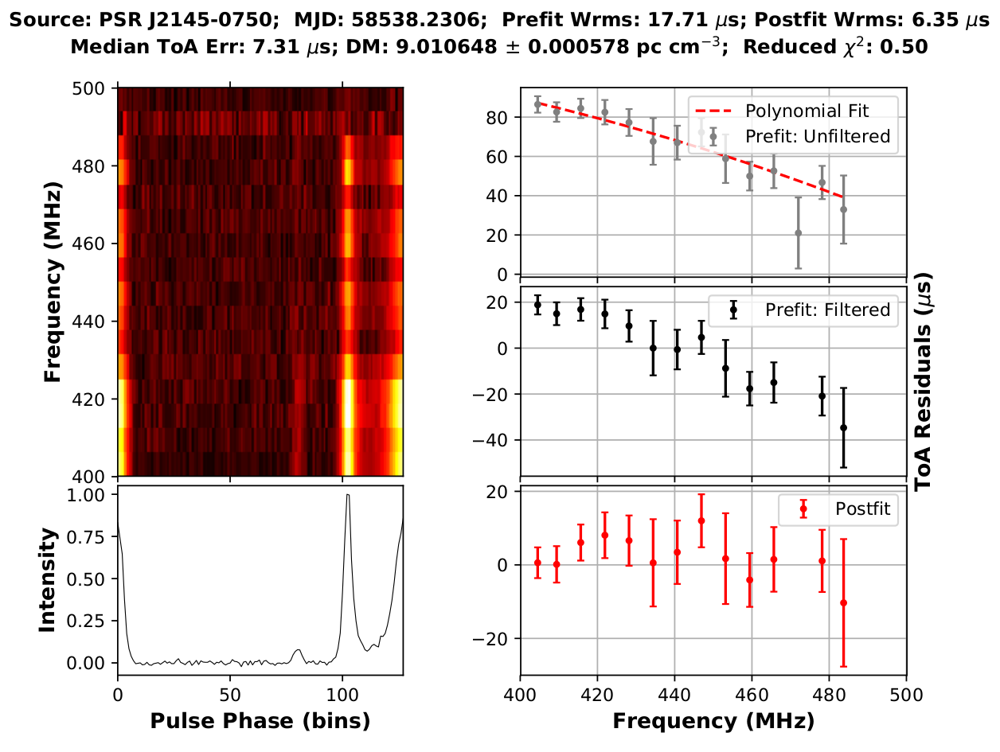

DMCalc
======

`DMCalc` is a Python based script that estimates the Dispersion Measure (DM) of wide-band pulsar data in [psrfits][psrfits] format. It uses the tools available with [PSRCHIVE][psrchive] python interface to get ToAs and then use [TEMPO2][tempo2] for DM fitting. A median absolute deviation (MAD) based ToA rejection algorithm following [Tiburzi et al. (2019)][tiburzi2019] is also implemented in the code to remove large outlier ToAs after performing a  fit using Huber Regression. Although the code is used for the analysis of the wide-band data from uGMRT, it can in principle be used for any pulsar datasets. More details about this and the results obtained using this can be seen in [Krishnakumar et al. (2020)][kkma_dmcalc].

## Dependencies
* [PSRCHIVE][psrchive]: Installed with python interface
* [TEMPO2][tempo2]: Used for fitting DM
* [scikit-learn][sklearn]: This is required for doing a Huber Regression fit to the ToAs.

## Usage

* Minimum running example:

`dmcalc.py -E ephemeris.par -M model.sm data.fits`

where, `ephemeris.par` is the ephemeris file of the pulsar, `model.sm` is the template file and `data.fits` is the data file. Additionally, there are other options that can be useful for further analysis. This also produces a plot of the DM corrected data and different stages of the fitting as shown below.

[psrfits]: https://www.atnf.csiro.au/research/pulsar/psrfits_definition/Psrfits.html
[psrchive]: http://psrchive.sourceforge.net/
[tempo2]: https://bitbucket.org/psrsoft/tempo2/src/master/
[tiburzi2019]: https://ui.adsabs.harvard.edu/abs/2019MNRAS.487..394T/abstract
[sklearn]: https://scikit-learn.org/stable/index.html
[kkma_dmcalc]: https://arxiv.org/abs/2101.05334
